<!-- ═══════════════ HEADER WAVE BANNER ═══════════════ -->

<!-- Wave banner (capsule-render) with the typing animation built in under the name. Light/dark variants: assets/header-banner-*.svg -->
<picture>
  <source media="(prefers-color-scheme: dark)" srcset="./assets/header-banner-dark.svg" />
  
</picture>

<!-- ═══════════════ GREETING ═══════════════ -->

### Hi, I'm Rimon (ihrimon). I turn business ideas into reliable products that are live and in use.

I've worked on production websites and web apps used by real businesses, including a B2B corporate site for an
apparel sourcing company and an online store for a fashion brand.

My focus is software that takes repetitive work off people's plates. I've built a CRM that scores and follows up on
leads, a receptionist that books appointments over chat and voice, and an assistant that answers a business's
Facebook, Instagram and WhatsApp messages around the clock.

**What I bring**

- **Ownership:** I take a feature from idea to production: UI, backend, AI integration and deployment
- **Clarity:** Specifications, acceptance criteria and ADRs before code; scope and trade-offs documented in the repo
- **Quality:** Tested, secure and observable code that holds up in production, not just in a demo
- **Collaboration:** Small, focused PRs backed by code review and CI, equally effective in a team or solo

<!-- ═══════════════ PROFILE STATS BADGES ═══════════════ -->

  
  
  

<!-- ═══════════════ EXPERIENCE ═══════════════ -->

## Professional Journey

<table width="100%" border="0" cellspacing="0" cellpadding="0">
  <tr>
    <td width="18%" align="center" valign="top">
      
    </td>
    <td valign="top">
      <strong>Software Engineer</strong> 
      🏢 <a href="https://brainstackstudios.com">Brain Stack</a> &nbsp;|&nbsp; London · New York · Dhaka &nbsp;|&nbsp; Remote (Contract)  
      • Build and ship client web apps with Next.js, TypeScript and Node.js, from scoping to deployment 
      • Integrate AI features such as LLM chat, booking agents and workflow automation into client products 
      • Maintain production sites for performance, SEO and reliability, and review teammates' code
    </td>
  </tr>
  <tr>
    <td width="18%" align="center" valign="top">
      
    </td>
    <td valign="top">
      <strong>Full Stack Developer</strong> 
      🏢 <a href="https://www.digiwinners.com/en">Digiwinners</a> &nbsp;|&nbsp; Uttara, Dhaka · Remote &nbsp;|&nbsp; Full-time  
      • Build responsive, scalable and secure web applications end to end 
      • Develop REST APIs, authentication and database schemas behind clean, reusable UIs 
      • Ship features to production through Git workflows, pull requests and code reviews
    </td>
  </tr>
  <tr>
    <td width="18%" align="center" valign="top">
      
    </td>
    <td valign="top">
      <strong>Full Stack Developer Intern (Frontend Focused)</strong> 
      🏢 <a href="https://www.digiwinners.com/en">Digiwinners</a> &nbsp;|&nbsp; Uttara, Dhaka · Remote  
      • Built responsive, high-performance web apps with Next.js, React and TypeScript 
      • Implemented state management and API integration for data-driven pages 
      • Worked in a team Git workflow with feature branches, pull requests and reviews
    </td>
  </tr>
</table>

<!-- ═══════════════ FEATURED PROJECTS═══════════════ -->

## Projects I've Built

| Project                       | What it does                                                                                                                          | Stack                                                                                    | Links                                                                                                                       |
| ----------------------------- | ------------------------------------------------------------------------------------------------------------------------------------- | ---------------------------------------------------------------------------------------- | --------------------------------------------------------------------------------------------------------------------------- |
| **AI CRM & Sales Automation** | Multi-tenant CRM with AI lead scoring, email drafts and an automation engine with human approval; 268 tests, CI.                      | NestJS · Next.js · PostgreSQL (RLS) · Prisma · Redis/BullMQ · Anthropic                  | [Live](https://ai-crm-sales-automation.vercel.app) · [Code](https://github.com/ihrimon/ai-crm-and-sales-automation-project) |
| **AI Health Receptionist**    | Books clinic appointments over chat & voice: LLM tool-calling, Google Calendar sync, switchable AI providers, Twilio calls.           | NestJS · Next.js · PostgreSQL · Twilio · Anthropic/Gemini/OpenAI/Groq                    | [Live](https://ai-health-receptionist.vercel.app) · [Code](https://github.com/ihrimon/ai-health-receptionist-project)       |
| **Social Ops AI Automation**  | Runs a business's Facebook, Instagram & WhatsApp: daily posts, RAG auto-replies, comment moderation, lead extraction, urgency alerts. | Express · TypeScript · MongoDB Vector Search · Gemini · React                            | [Code](https://github.com/ihrimon/social-ops-ai-automation-project)                                                         |
| **Faith Journey**             | Modest-wear e-commerce for women (frontend, team): 20+ type-safe components, query caching cutting redundant API calls ~15%.          | Next.js · TypeScript · TanStack Query · React Hook Form · Zod · shadcn/ui · Tailwind CSS | [Live](https://faithjourneybd.com/)                                                                                         |
| **Cloths 'R' Us**             | Corporate B2B site for an apparel sourcing company: 9 SEO-optimized pages, product catalog, images cut from 335 MB to 32 MB.          | Next.js 16 · React 19 · TypeScript · Tailwind v4 · GSAP · Netlify                        | [Live](https://www.clothsrusbd.com/)                                                                                        |

<!-- ═══════════════TECHNICAL SKILLS═══════════════ -->

## Engineering Toolkit

| Category            | Skills                                                                                              |
| :------------------ | :-------------------------------------------------------------------------------------------------- |
| **Languages**       | TypeScript, JavaScript, Python, Dart, C/C++, PHP, SQL                                               |
| **Backend**         | Node.js, NestJS, Express, Fastify, FastAPI, REST APIs, Socket.IO, Laravel                           |
| **Frontend**        | Next.js, React, Tailwind CSS, Redux Toolkit, Zustand, TanStack Query, GSAP, Framer Motion, Three.js |
| **Mobile**          | React Native, Expo, Flutter                                                                         |
| **Database**        | PostgreSQL, Prisma, TypeORM, MongoDB (Vector Search), Redis                                         |
| **AI**              | Anthropic, Gemini, OpenAI, Groq, RAG, embeddings, tool calling, structured output                   |
| **Infra & Quality** | Docker, GitHub Actions, BullMQ, Jest, Vitest, Playwright, Vercel, Railway, Render                   |
| **Integrations**    | Stripe, Twilio, Meta Graph API, WhatsApp Cloud API, Google Calendar/Sheets, Cloudinary, Clerk       |

🔭 **Currently building:** AI voice agents & workflow automation &nbsp;·&nbsp; 📚 **Learning:** AI agents, MCP and LLM evaluation, tracked in [ai-engineering-journey](https://github.com/ihrimon/ai-engineering-journey)

<!-- ═══════════════ HOW I WORK ═══════════════ -->

## How I Build Software

- **Plan before building:** SRS, milestone plan and ADRs live in the repo; the AI CRM shipped all 9 planned milestones against them
- **Test against reality:** Integration tests on real Postgres and Redis, Playwright E2E for user journeys, CI on every push
- **Secure by default:** Postgres RLS tenant isolation, RBAC, Zod validation, rate limiting and HMAC-verified webhooks
- **Design for failure:** Idempotent jobs, retries with backoff, crash-safe queues, real health checks and request-ID logs
- **AI with guardrails:** Provider-agnostic LLMs, deterministic test stubs, structured outputs and human approval on customer actions

<!-- ═══════════════GITHUB INSIGHTS═══════════════ -->

## Activity at a Glance

<!-- Cards are self-hosted in assets/ and refreshed daily by .github/workflows/github-insights.yml -->

  <a href="https://github.com/ihrimon?tab=repositories">
    <picture>
      <source media="(prefers-color-scheme: dark)" srcset="./assets/github-insights-dark.svg" />
      
    </picture>
  </a>

<!-- ═══════════════CONNECT WITH ME═══════════════ -->

## Let's Build Something Together

<!-- Call To Action Typing Animation: self-hosted copy of readme-typing-svg (source: assets/connect-cta.svg) -->

<!-- Social Media & Contact Badges -->

  
  
  
  
  
  
  

<!-- ═══════════════FOOTER AND COPYWRITE═══════════════ -->
<!-- Self-hosted capsule-render footer (source: assets/footer-banner.svg). Update the year in that file each January -->

  

